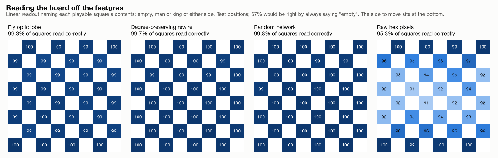

# fly-sim

This project takes the right optic lobe of the male *Drosophila* connectome
([MaleCNS v1.0](https://male-cns.janelia.org/), Janelia FlyEM / Cambridge / Google, CC-BY), freezes
it exactly as reconstructed, and shows it pictures: clothing, handwritten digits, and positions from
a game of checkers. Then it asks what can be read back out of the neurons.

```bash
uv sync
./scripts/download_data.sh       # ~1.1 GB of connectome data
./scripts/download_datasets.sh   # Fashion-MNIST and MNIST
```

## The eye

`fly_sim/optic_lobe.py` cuts the right eye out of the 165,122 traced neurons:

```
49,401 neurons · 6,148,494 connections
  2,677 lamina neurons across 892 hex columns   <- light goes in here
  4,611 visual projection neurons                <- we read out here
```

Each connection is signed by the sending neuron's neurotransmitter (acetylcholine excites; GABA,
glutamate and histamine inhibit). Light enters at the lamina rather than the photoreceptors, which are
only ~13% traced, and feedback from the central brain is left out. Neurons are assigned to an eye by
where their inputs come from, not where their cell body sits.

The dynamics are a frozen firing-rate model (`fly_sim/rate_model.py`):

```
τ dr/dt = −r + relu(g · Ŵr + b + light)
```

with every neuron's inputs normalised to sum to 1 and the gain set to 1.4, safely below where the
network becomes unstable (~1.67). Nothing in the eye is ever trained.

Every result is compared against two null networks (`fly_sim/baselines.py`) with the same neurons,
inputs and outputs: a **rewire** that keeps each neuron's exact outputs and input count but shuffles
who connects to whom, and a **random** network matched only on size, density and weights.

## Showing it a picture

Images are mapped onto the eye's hexagonal column lattice and blurred to one column's resolution,
roughly what a single ommatidium resolves. The picture is flashed on after a short blank and jittered
by half a column, so nothing can rely on it landing in exactly one place.

A checkers board is drawn with two cues that survive that blur: **brightness** says whose piece it
is, **size** says man or king. The board is stretched to the eye's taller shape so every playable
square covers at least seven columns.

## What it sees

A linear readout on the 4,611 output neurons can name the contents of each of the 32 squares
(empty, or a man or king of either side). Guessing "empty" everywhere would score 67.1%.



| network | squares read correctly |
|---|---|
| random network | 99.8% |
| rewire | 99.7% |
| **fly optic lobe** | **99.3%** |
| raw pixels, no eye | 95.3% |

Passing the image through the network helps: every network beats the raw pixels. The fly's own wiring
does not help. The random network reads the board slightly better.

**Time matters more than space.** Ways of drawing and presenting the board, scored on the
fraction of boards read with *no* square wrong:

| change | squares | whole boards perfect |
|---|---|---|
| original (0.3 s look) | 98.5% | 65.9% |
| wider size contrast | 98.6% | 66.5% |
| four brightness levels, no size cue | 95.4% | 30.6% |
| bigger board | 95.9% | 28.5% |
| four brightness levels **and** size | 98.8% | 70.2% |
| **the same, looked at for 0.6 s** | **99.7%** | **93.0%** |

Redrawing the board helped a little at best, and two changes hurt badly: a bigger board pushes the
corners off the eye, and dropping the size cue collapses king detection. Looking twice as long took
boards read perfectly from 70% to 93%, by giving the network more evidence per square. With a fuller
readout this reaches 99.8% of squares and 95.2% of boards perfect.

**Dense supervision is what makes reading work.** A readout trained to name all 32 squares at once
learns from 160 targets per image and generalises from a few thousand examples. A readout trained on
one number per image (how good the position is) does much worse (R² 0.51, against 0.63 when the board
is decoded first), even though the same information is linearly available.

## Playing checkers

The decoded board was fed to a learned position evaluator and used to play checkers (`fly_sim/checkers.py`, `fly_sim/search.py`). Every judgement is made from what the neurons report; the true board never reaches the evaluator. Over 40 games per opponent it scores **97.5%** against a random player, **53.8%** against a one-move-lookahead engine and **26.2%** against a two-move-lookahead engine.

Perception is not what limits it. Given the true board instead of the decoded one, the same evaluator
picks an expert engine's move only 2.5 points more often.

## Is the fly's wiring special?

Not for this. The null networks match it everywhere:

| | fly | rewire | random |
|---|---|---|---|
| reading the board (squares) | 99.3% | 99.7% | 99.8% |
| predicting a position's value (R²) | 0.655 | 0.679 | 0.662 |
| ranking moves, eye frozen | 54.5% | 64.8% | 65.8% |
| ranking moves, all 6.1M synapses trained | 66.0% | 66.3% | 67.8% |

Training the synapses themselves (`fly_sim/trainable.py`, backpropagation through time written by
hand) helps the fly most, but only because it starts furthest behind. The real connectome is the
*worst* starting point of the three. A likely reason: its responses are far less spread out than the
random networks' (σ 0.011 versus 0.035–0.042), so a linear readout has fewer independent directions to
use.

## Images too

On Fashion-MNIST, a linear classifier on the fly's output neurons reaches 84.3% against 79.1% on raw
pixels; on moving digits, 60.5% against 36.6%, though that pixel baseline is weak because averaging
over time smears the digit. The null networks have not been run on images, and the checkers results
suggest they would match the fly there as well.

## Reproduce

```bash
uv run python experiments/checkers_positions.py --games 600                        # labelled positions
uv run python experiments/extract_features.py --dataset checkers --network fly     # and rewired, random
uv run python experiments/checkers_readability.py                                  # what each network sees
uv run python experiments/encoding_search.py                                       # how best to show it
uv run python experiments/extract_features.py --dataset checkers-v2 --network fly  # the 0.6 s look
uv run python experiments/strong_readout.py                                        # decode, then judge
uv run python experiments/train_connectome.py                                      # train the synapses
```

Features are cached in `data/features/`. One board costs 80 to 140 sparse matrix products over 6.1
million connections, so a full extraction takes about an hour per network.

## Layout

| | |
|---|---|
| `fly_sim/connectome.py`, `optic_lobe.py` | load the connectome, cut out the eye |
| `fly_sim/rate_model.py`, `trainable.py` | frozen dynamics, and the trainable version |
| `fly_sim/stimulus.py`, `vision.py` | pictures onto the eye, one shared protocol |
| `fly_sim/baselines.py` | the rewired and random networks |
| `fly_sim/probe.py` | ridge readout with leave-one-out tuning |
| `fly_sim/checkers.py`, `search.py` | the game and the lookahead |
| `experiments/` | every result above |
