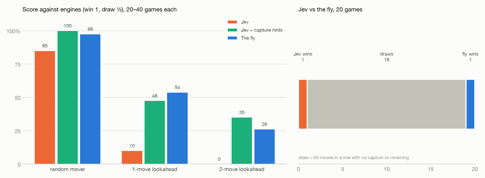
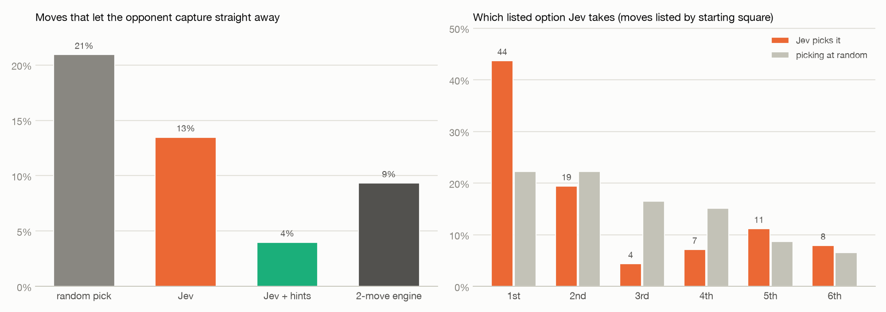
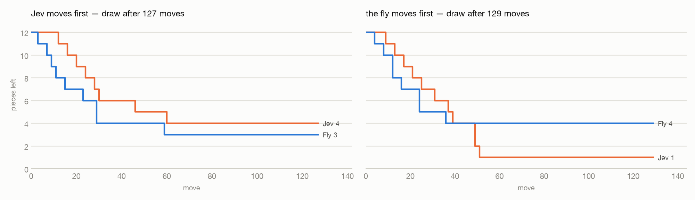

# Jev plays checkers

Can [Jev](https://typesafe.ai) play checkers? And how does it do against a fruit fly's eye?

Jev doesn't write text. It picks one answer from a list of options it's given. So on every turn, the
code lists the legal moves and Jev picks one. Nothing else helps it: no search, no engine, no
evaluation.

We tested it three ways:

1. Against engines: a random mover, and alpha-beta searches that look one and two moves ahead.
2. With **capture hints**: the same, except each option also says whether the opponent can capture
   straight after the move.
3. Against **the fly**: a checkers player whose eyes are the right optic lobe of the *Drosophila*
   connectome (more [below](#the-opponent)).

## How it went



| | vs random | vs 1-move lookahead | vs 2-move lookahead | vs the fly |
|---|---|---|---|---|
| **Jev** | 85% (17–0–3) | 10% (1–2–17) | 0% (0–0–20) | **50% (1–18–1)** |
| **Jev + capture hints** | 100% (20–0–0) | 47.5% (2–15–3) | 35% (1–12–7) | not run |
| the fly | 97.5% | 53.8% | 26.2% | — |

Score counts a win as 1 and a draw as ½; wins–draws–losses in brackets. Jev played 20 games per
opponent and moved first in half of them. The fly's numbers are from 40 games each.

- **Jev on its own easily beats random play, but loses to any engine that looks ahead.** It won 1 of
  40 games against the two engines.
- **Against the fly it's even.** 18 of 20 games were draws. A game counts as a draw after 60 moves
  in a row with no capture and no crowning, and both players reach endgames they can't finish.
- **One line of help per option closes most of the gap.** With capture hints, Jev scores about as
  well as the fly against the engines, and better than the fly against the 2-move engine.

## What goes wrong



**Jev leaves pieces hanging.** On 13.5% of its moves the opponent can capture straight away. Picking
at random would do that on 21% of moves, so Jev is doing better than chance, but the 2-move engine
does it only on 9% (sometimes on purpose, as a trade). Checkers makes this very costly because
captures are compulsory: a piece left hanging is usually just lost. The hint cuts the rate to 4%,
and that change alone is worth 37.5 points against the 1-move engine.

**Jev prefers the first option in the list.** Moves are listed by starting square, so the first one
is usually the most advanced piece. Jev picks it 44% of the time; picking at random would give 22%.
Some of that may be a real preference for pushing forward, but the 3rd and 4th options are picked far
less often than chance. So the order of the list shapes the choice.

**It's not sure of itself.** In the median position, Jev's top move gets 28% of the probability.

## Jev vs the fly, move by move

We recorded two more games with every decision kept: Jev's probability for every legal move, the
fly's evaluator score for every legal move, and what the fly's eye read off the board after each of
its moves. Both games were drawn.



Both games follow the same pattern. All the captures happen in the first 60 moves, and then nothing
happens. When Jev moves first, it ends one piece up and can't convert that. When the fly moves
first, it ends four pieces to one up and still can't win. The fly scores each position as it stands,
with no search, and a king chase needs a plan several moves deep. The fly's perception is not the
problem: its eye read every square correctly on every one of its moves in both games.

**Replay:** [`docs/jev_replay.html`](docs/jev_replay.html) is a standalone page. Download it and open
it in a browser, because GitHub shows HTML files as source. Use the arrow keys or the Play button to
step through the fly-first game. Each step shows the move, every option with Jev's probabilities or
the fly's scores, and, for fly moves, the board as the fly's neurons decoded it.

## What Jev is shown

Squares are numbered 1–32 from Jev's own side, so it always plays up the board, whichever colour
it is. The state and the options for the opening move:

```
board:           8   o   o   o   o        options:
                 7 o   o   o   o            21-17  man from 21 to 17
                 6   o   o   o   o          22-17  man from 22 to 17
                 5 .   .   .   .            22-18  man from 22 to 18
                 4   .   .   .   .          ...
                 3 x   x   x   x            24-20  man from 24 to 20
                 2   x   x   x   x
                 1 x   x   x   x          with --hints each option adds, e.g.
                   a b c d e f g h          "; the opponent must then capture,
your_men:        21 ... 32                     taking up to 1 of your pieces"
opponent_men:    1 ... 12
material:        you 12 men + 0 kings, opponent 12 men + 0 kings
```

It also gets the rules in one paragraph. Captures are compulsory, so when a capture exists only the
captures are listed. Up to 18 options came up in one position. Positions with only one legal move
are played without asking.

## The opponent

The fly is the strongest player the earlier work in this repository built. Every board it considers
is drawn as a picture and shown for 0.6 s to a frozen firing-rate model of the right optic lobe of
the male *Drosophila* connectome ([MaleCNS v1.0](https://male-cns.janelia.org/), Janelia FlyEM /
Cambridge / Google, CC-BY): 49,401 neurons and 6.1 million signed synapses, never trained. A linear
decoder reads the board back off the 4,611 output neurons. A linear evaluator scores it, and forced
captures are played out first. So the fly looks one move ahead, and only through its eyes. Its code
is in `fly_sim/` and `experiments/play_server.py`; the full write-up of the fly work is on `main`.

## Run it

```bash
uv sync --extra jev              # put TYPESAFE_API_KEY in .env
./scripts/download_data.sh       # ~1.1 GB of connectome data; only needed for the fly
```

```bash
uv run python experiments/jev_checkers.py estimate --games 20
```

```bash
uv run python experiments/jev_checkers.py --max-calls 4000 run --games 20 --opponents random depth1 depth2
```

```bash
uv run python experiments/jev_checkers.py --max-calls 2000 run --games 20 --opponents fly
```

```bash
uv run python experiments/jev_checkers.py --max-calls 300 replay --fly-first
```

```bash
uv run python experiments/jev_figures.py
```

`run` needs `--max-calls`, a hard cap on paid calls, and refuses to call the API without it.
`--offline` swaps Jev for a random picker to test the loop without an API key. `--hints` turns on
capture hints. `replay` records one fully logged game and writes `docs/jev_replay.html`; to rebuild
that page from a saved game, use `page <game.json>`. Results go to `data/processed/jev_checkers.csv`,
and every Jev call is logged to `data/processed/jev_checkers_calls.jsonl`.

Cost: 6,312 calls over everything above (roughly $0.30), about 0.33 s per call, no failed calls. The
matches against engines take a minute or two each. The games against the fly take about 15 minutes
per 20, because the eye simulation takes about 0.5 s for each board it looks at.
